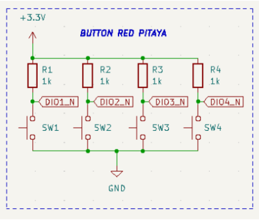
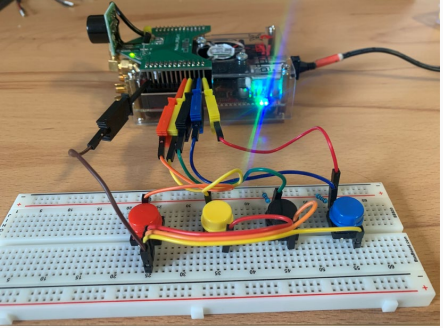
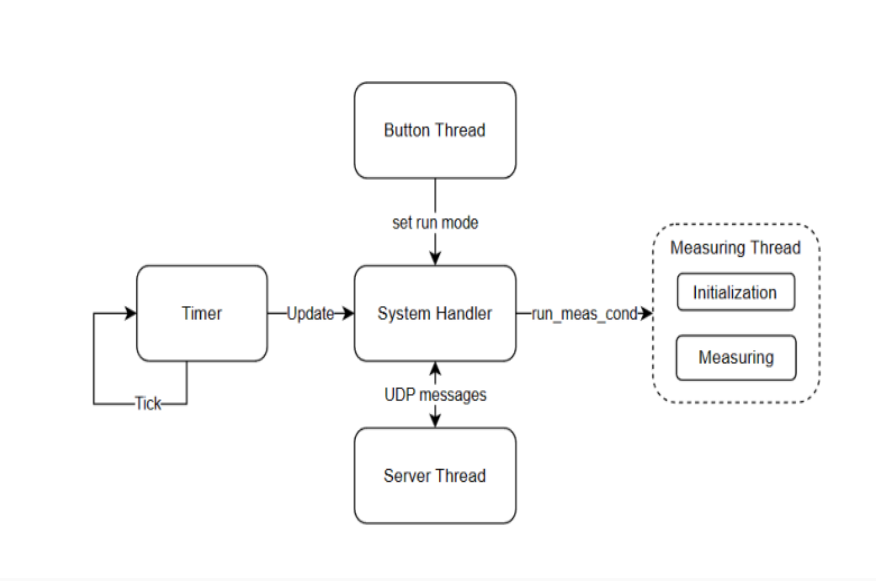
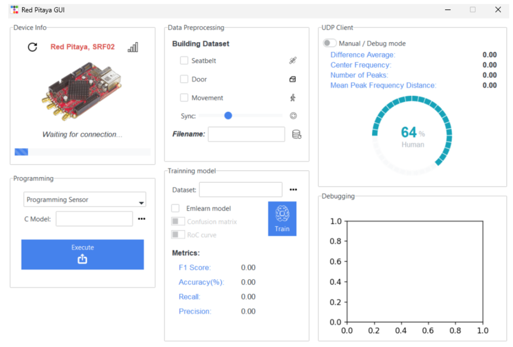
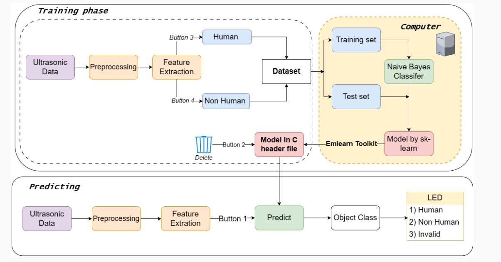

# Tiny Machine Learning for Ultrasonic Object Classification

## Introduction
This repository contains the source code and instructions to operate the **Smart Sensor Application** for ultrasonic object classification using Tiny Machine Learning (TinyML) on the Red Pitaya platform. The system is designed for differentiating different materials on ultrasonic frequency analysis using a Naive Bayes classifier.

## Table of Contents
- [Installation](#installation)
- [Dependencies](#dependencies)
- [System Architecture](#system-architecture)
- [Usage Instructions](#usage-instructions)
- [Building the Dataset](#building-the-dataset)
- [Training the Model](#training-the-model)
- [Deploying on Red Pitaya](#deploying-on-red-pitaya)
- [Data Visualization](#data-visualization)
- [Cronjob Automation](#cronjob-automation)
- [Contributing](#contributing)
- [License](#license)

---

## Installation
1. **Clone the repository**:

   ```bash
   git clone https://github.com/username/smart-sensor-application.git
   cd smart-sensor-application
   ```

2. **Install required dependencies**:

   ```bash
   pip install -r requirements.txt
   ```

3. **Set up the Red Pitaya platform**:
- The breakout board that connected to the SRF02 ultrasonic sensor is custom. 
- Button and LED connection is followed by schematic below:

<p align="center">
  
    

</p>


4. **Configure SSH and file transfer**:
   - Set up SSH on your Red Pitaya device to enable remote communication.
   - Configure the IP and hostname under the `config.json` file under asssets folder.

---

## Dependencies
The project relies on several Python libraries and TinyML frameworks:

- `paramiko`: For SSH communication and remote command execution.
- `matplotlib`: For data visualization.
- `scikit-learn`: For machine learning model training.
- `emlearn`: A TinyML framework to convert the Naive Bayes model to C format for deployment on Red Pitaya.
- `kiss_fft`: For fast Fourier transform and feature extraction.

---

## System Architecture
The system architecture comprises several threads running on the Red Pitaya platform to manage different functionalities:
1. **Server Thread**: Listens for UDP commands and processes user inputs.
2. **Measure Thread**: Handles the ADC and FFT operations to collect sensor data.
3. **Time Thread**: Controls the timing of measurement intervals (e.g., every 100ms).
4. **Button Thread**: Manages user interaction through physical buttons connected to GPIO.


---

## Usage Instructions

### Running the GUI



1. **Starting the GUI**: Run the Python GUI application on your computer:

   ```bash
   python smart_sensor_application.py
   ```

2. **Remote Command Execution**: Use the built-in SSH interface to control the Red Pitaya device from the GUI. The following options are available:
   - **Start Sensor**: Begin data collection and object classification using the ultrasonic sensor.
   - **Stop Sensor**: Stop the sensor operations.

### Button Operations
- **Button 1**: Log non-human sensor data and save it to a binary file.
- **Button 2**: Log human data.
- **Button 3**: Run the Box Classifier.
- **Button 4**: Run the Naive Bayes Classifier.

---

## Building the Dataset



1. **Collect Data**:
   - Use the button interface to collect labeled data for human and non-human entities.
   - Save the feature data in binary format on the Red Pitaya device.

2. **Sync Data**:
   - Transfer the data from Red Pitaya to your local machine using SFTP, which is integrated into the GUI.

3. **Convert Data**:
   - Convert the binary data into a `.xlsx` format for easier manipulation and dataset creation.

4. **Labeling**:
   - Label the dataset: `1` for human objects, and `0` for non-human objects.

---

## Training the Model
1. **Train the Naive Bayes Classifier**:
   - Use `scikit-learn` to train the Naive Bayes classifier on the labeled dataset:

     ```python
     from sklearn.naive_bayes import GaussianNB
     model = GaussianNB()
     model.fit(X_train, y_train)
     ```

2. **Convert the Model to C**:
   - Use `emlearn` to convert the trained model into a C header file for deployment on Red Pitaya:

     ```python
     import emlearn
     emlearn.convert(model)
     ```

---

## Deploying on Red Pitaya
1. **Upload the Model**:
   - Transfer the generated C model file to the Red Pitaya device via SFTP or using the GUI's model upload feature.

2. **Compile and Run**:
   - Compile the Red Pitaya firmware with the new model using the following command:

     ```bash
     make
     ./sensor_start.sh
     ```

---

## Cronjob Automation
To automate the sensor system startup, the following cron job can be scheduled on Red Pitaya:

```bash
@reboot sleep 20 && sh /path/to/sensor_start.sh > /dev/null 2>&1
```

This ensures that the sensor system starts automatically on reboot without needing manual intervention from external software.

---


### Video Demonstration
Watch my demonstration video:

<iframe src="https://youtu.be/sZNM9QpZ5yg" width="640" height="360" frameborder="0" allow="autoplay; fullscreen" allowfullscreen></iframe>

---

## Contributing
This project is under MIT license. Feel free to fork this repository, make enhancements, and submit pull requests. Contributions are welcome!

---

